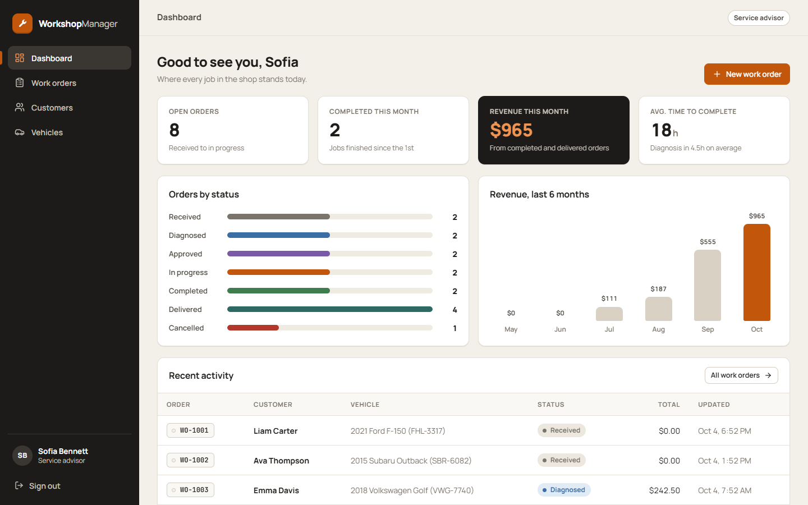
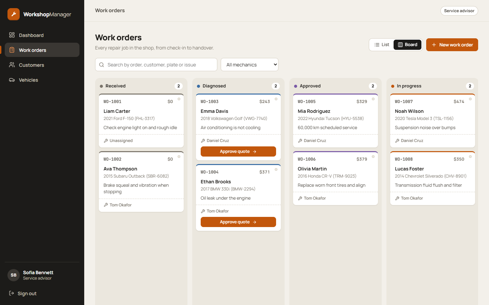
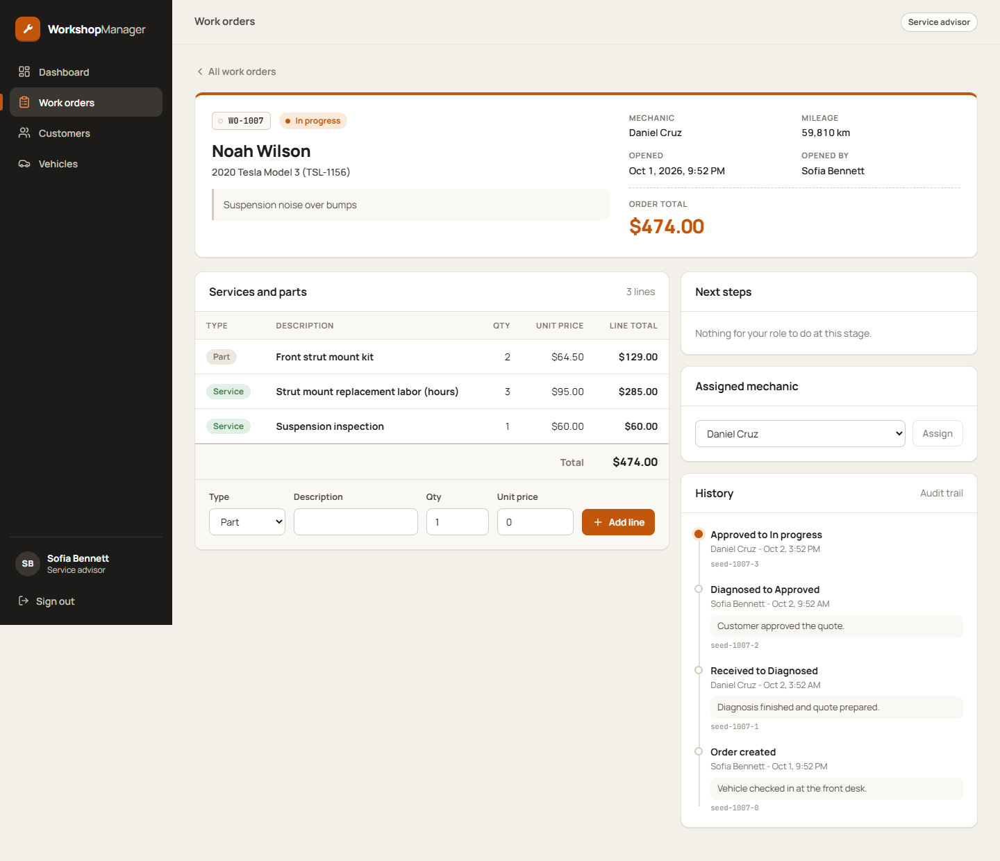
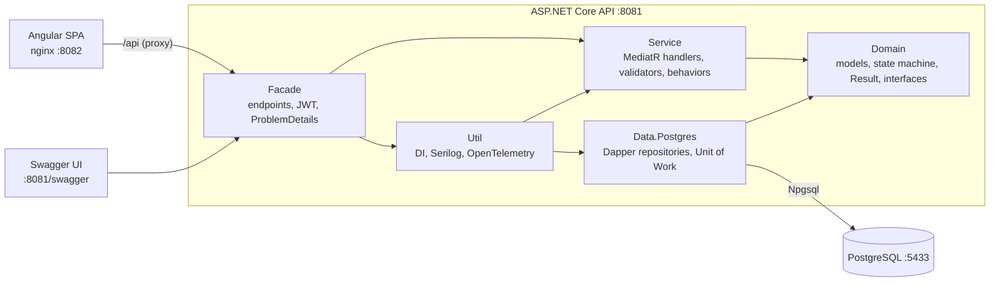
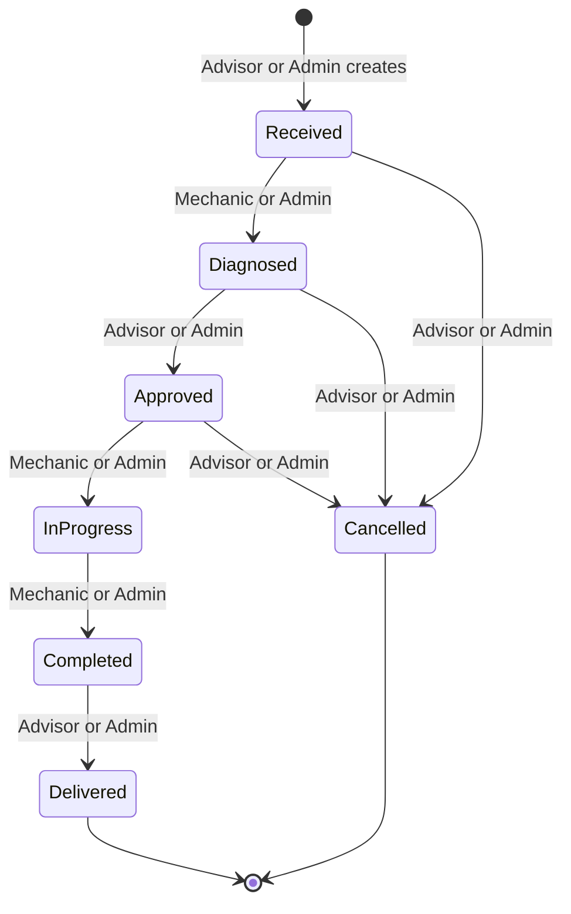
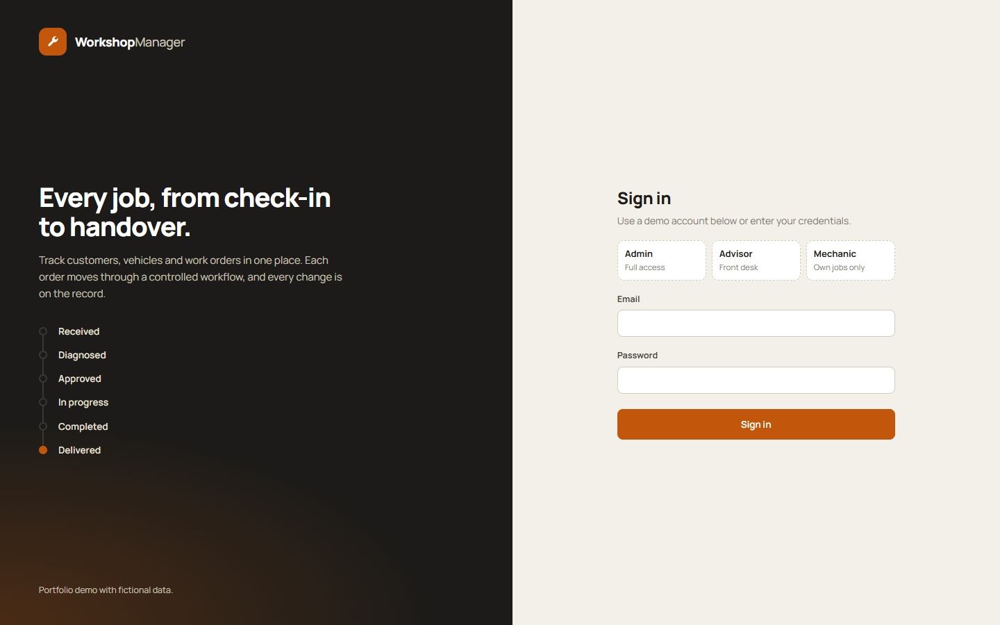
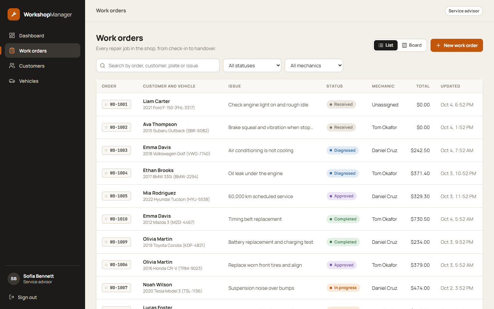
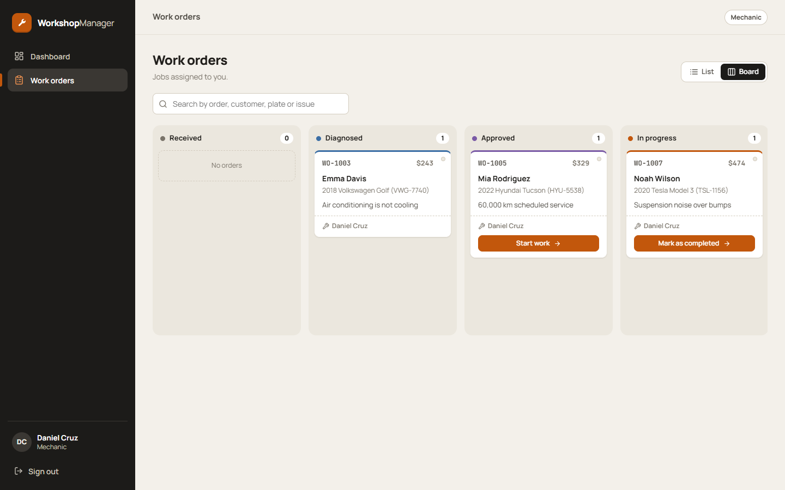
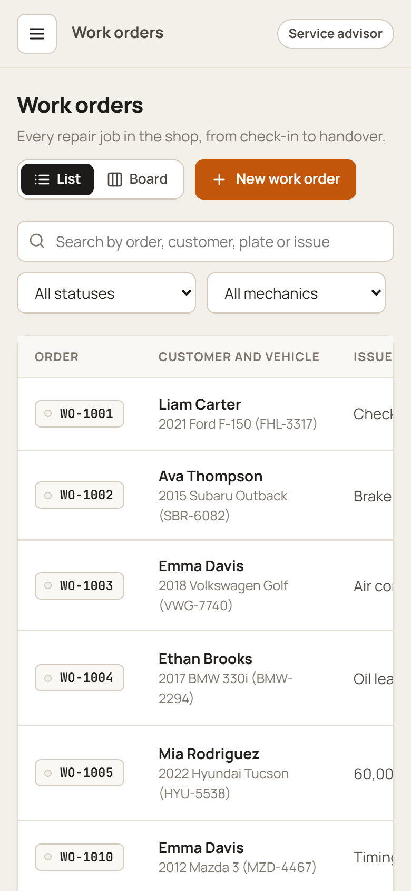

# WorkshopManager

A work-order system for an auto repair shop: customers, vehicles and repair jobs that move through a controlled workflow, with role-based access and a full audit trail. Built as a portfolio project with fictional data.

**Stack:** .NET 10 minimal API, PostgreSQL, Angular 21, Docker Compose. One command starts everything.



| | |
|---|---|
|  |  |

## What it does

- **Customers and vehicles**: searchable, paginated lists with create and edit forms. A customer can own many vehicles and license plates are unique.
- **Work orders**: created by the front desk with an `Idempotency-Key`, assigned to a mechanic, priced with service and part lines, and moved through the workflow. The total is always calculated on the server.
- **Role-aware workflow**: every transition checks *who* is allowed to run it. Mechanics only see and advance the orders assigned to them.
- **List and kanban views**: filter by status, mechanic or free text. Board cards expose only the actions the signed-in role can run.
- **Audit trail**: each transition and assignment is stored with the user from the token, the time and the request's correlation id.
- **Dashboard**: orders by status, revenue for the last six months, average time to diagnose and to complete, recent activity.

## Architecture



The API is a standalone service, not a modular monolith, because it owns one small bounded context and one database. The layers are plain projects with flat names, and the dependency rules are enforced by tests (see [Tests](#tests)). More detail in [docs/architecture.md](docs/architecture.md).

### Work order states



Extra rules: a mechanic must be assigned before diagnosing, starting or completing; at least one line item is required to approve; line items are locked once the order is completed.

## Tech stack

| Area | Choice |
|---|---|
| Runtime | .NET 10, ASP.NET Core minimal APIs |
| Application | MediatR (CQRS), FluentValidation, pipeline behaviors for logging, validation and transactions |
| Data | PostgreSQL 16, Dapper + Npgsql, Polly for connection retries, explicit command timeout |
| Security | JWT bearer, PBKDF2-SHA256 password hashing, role policies, login rate limiting, CORS from configuration |
| Observability | Serilog JSON logs with `correlation_id` and `trace_id`, OpenTelemetry traces and metrics, `/health/live` and `/health/ready` |
| API contract | OpenAPI with Swagger UI and a Bearer scheme, RFC 7807 problem details, versioned under `/api/v1` |
| Frontend | Angular 21 standalone components, signals, lazy routes, functional interceptor and guards, reactive forms, no UI library |
| Tests | xUnit, NSubstitute, FluentValidation test helpers, architecture tests |
| Delivery | Multi-stage Dockerfiles, Docker Compose, non-root containers, nginx for the SPA with an `/api` proxy |

## Run it

Requirements: Docker with Compose.

```bash
cp .env.example .env
docker compose up --build
```

| What | URL |
|---|---|
| Web app | http://localhost:8082 |
| API | http://localhost:8081 |
| Swagger UI | http://localhost:8081/swagger |
| Health | http://localhost:8081/health/live and http://localhost:8081/health/ready |
| PostgreSQL | `localhost:5433` (user and password from `.env`) |

The database is created and seeded on first start from `sql/01-schema.sql` and `sql/02-seed.sql`. Both scripts are idempotent. To start from scratch run `docker compose down -v`.

### Demo accounts

All accounts use the demo password `Workshop#2026`. They are fictional and exist only in the seed data.

| Role | Email | Can do |
|---|---|---|
| Admin | `admin@example.com` | Everything |
| Advisor | `advisor@example.com` | Customers, vehicles, create and assign orders, approve, deliver, cancel |
| Mechanic | `mechanic1@example.com` | Own assigned orders only: diagnose, start, complete, add lines |
| Mechanic | `mechanic2@example.com` | Same, with a different set of orders |

The seed contains 8 customers, 10 vehicles and 15 work orders in every state, with line items and history.

### Configuration

Everything is configured with environment variables using the `Section__Key` convention. Secrets are never committed.

| Variable | Purpose |
|---|---|
| `Postgres__ConnectionString` | Connection string (required) |
| `Postgres__CommandTimeoutSeconds` | Command timeout, default 30, maximum 600 |
| `Jwt__Secret` | Signing key, at least 32 characters (required) |
| `Jwt__Issuer`, `Jwt__Audience`, `Jwt__ExpiresMinutes` | Token settings |
| `Cors__AllowedOrigins` | Comma separated origins allowed by CORS |
| `RateLimiting__LoginPermitLimit` | Login attempts per minute and IP, default 10 |
| `OTEL_EXPORTER_OTLP_ENDPOINT` | Optional OTLP endpoint for traces and metrics |

### Running without Docker for the API

```bash
export Postgres__ConnectionString="Host=localhost;Port=5433;Database=workshop;Username=workshop;Password=..."
export Jwt__Secret="a-random-string-of-at-least-32-characters"
dotnet run --project src/Facade --urls http://localhost:8081
cd web && npm install && npm start
```

`npm start` serves the SPA on http://localhost:4200 and proxies `/api` to port 8081.

## Tests

```bash
dotnet test
```

- **UnitTests** cover every handler with business rules: valid and invalid transitions per role, a mechanic reaching only their own orders, server-side totals and rounding, idempotent order creation, optimistic conflicts, plus validators, pipeline behaviors and the security services.
- **ArchitectureTests** verify the dependency rules between projects, that `Domain` only depends on the base class library (no data, messaging or web libraries), naming conventions and the Request/Response versus Command/Query split.

With the stack running, a black-box check of the real API (authentication, roles, idempotency, race conditions, rate limiting) is available:

```bash
node scripts/api-smoke.mjs
```

It creates a few extra records. The login rate limit is shared per IP, so wait a minute between runs.

## Project structure

```
workshop-manager/
├── src/
│   ├── Facade/         Host, endpoints, Request/Response contracts, JWT and policies, middleware, Dockerfile
│   ├── Util/           DependencyInjector.AddInfraestructura, Serilog, OpenTelemetry, hashing and tokens
│   ├── Service/        Commands and Queries (Command, Handler, Validator per use case), pipeline behaviors
│   ├── Data.Postgres/  Dapper repositories, Unit of Work, connection resilience
│   └── Domain/         Models, state machine, Result and Error, repository and service interfaces
├── tests/
│   ├── UnitTests/
│   └── ArchitectureTests/
├── web/                Angular app, Dockerfile and nginx config
├── sql/                01-schema.sql and 02-seed.sql, mounted into the Postgres container
├── scripts/            api-smoke.mjs
├── docs/               Architecture notes and screenshots
├── docker-compose.yml
└── .env.example
```

## Design decisions

**Atomic state transitions, not read-then-write.** A transition is a single conditional statement:

```sql
UPDATE work_orders SET status = @NewStatus, updated_at = @NowUtc
WHERE work_order_id = @WorkOrderId AND status = @ExpectedStatus
```

When zero rows change, someone else moved the order first and the API answers `409 Conflict`. Clients may also send `expectedStatus` so a stale screen gets a 409 instead of a surprise. Line items and the order total follow the same idea: the total is incremented in the same conditional update that guards the status, so two simultaneous additions cannot lose an amount.

**One owner for the transaction.** Each command is one transaction. A MediatR behavior opens it, commits when the result is a success and rolls back on a failure or an exception. Repositories refuse to run a mutating statement outside a transaction.

**Authorization is more than a valid token.** Endpoints use role policies, and the state machine adds a role per transition. Horizontal access is decided from the token: a mechanic listing orders is forced to their own scope whatever the query string says, and opening or changing someone else's order returns 403. The audit user, the creator and every history entry come from the authenticated principal, never from a request body.

**Idempotent order creation.** `POST /api/v1/work-orders` requires an `Idempotency-Key`. The key is stored per user with a fingerprint of the payload, inside the same transaction as the order. A retry with the same payload returns the original order (`200` plus `Idempotent-Replayed: true`), parallel requests create exactly one order, and reusing a key with a different payload is rejected with `422`.

**A consistent error contract.** Every failure is an RFC 7807 problem with `type`, `title`, `status`, `traceId` and a machine readable `errorCode`. Handlers return `Result` values instead of throwing, and a single mapper turns them into 400, 401, 403, 404, 409, 422 or 500. Technical failures never leak their message.

**Traceable by design.** Every request carries an `X-Correlation-Id` (generated when absent) that appears in the logs, in the problem response, in the response header, in the history table and in the Postgres `application_name` of the connection.

**Request and Response are not Command and Query.** The HTTP contract lives in `Facade` with full field names (`CustomerId`, `IsActive`). The use cases in `Service` have their own types and the endpoint maps between them explicitly.

## API overview

All routes live under `/api/v1`.

| Area | Endpoints |
|---|---|
| Auth | `POST /auth/login`, `GET /auth/me` |
| Customers | `GET /customers`, `GET /customers/{id}`, `POST /customers`, `PUT /customers/{id}` |
| Vehicles | `GET /customers/{id}/vehicles`, `POST /customers/{id}/vehicles`, `GET /vehicles`, `PUT /vehicles/{id}` |
| Staff | `GET /users/mechanics` |
| Work orders | `GET /work-orders`, `GET /work-orders/{id}`, `POST /work-orders`, `PUT /work-orders/{id}/mechanic`, `POST /work-orders/{id}/transitions`, `POST /work-orders/{id}/items` |
| Dashboard | `GET /dashboard/stats` |

The interactive reference is at `/swagger`.

## Screenshots

| Screen | File |
|---|---|
| Sign in | `docs/screenshots/login.png` |
| Dashboard | `docs/screenshots/dashboard.png` |
| Work orders, list view | `docs/screenshots/work-orders-list.png` |
| Work orders, kanban board | `docs/screenshots/kanban.png` |
| Work order detail with history | `docs/screenshots/work-order-detail.png` |
| New work order dialog | `docs/screenshots/new-work-order.png` |
| Customers | `docs/screenshots/customers.png` |
| Mechanic view (own orders only) | `docs/screenshots/mechanic-board.png` |
| Mobile | `docs/screenshots/mobile-work-orders.png` |






## License

All data is fictional. The code is provided as a portfolio sample.
