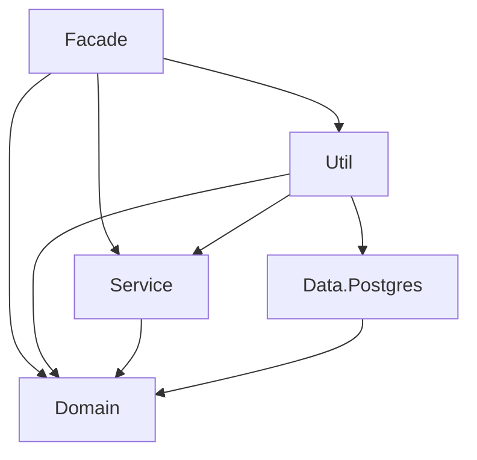
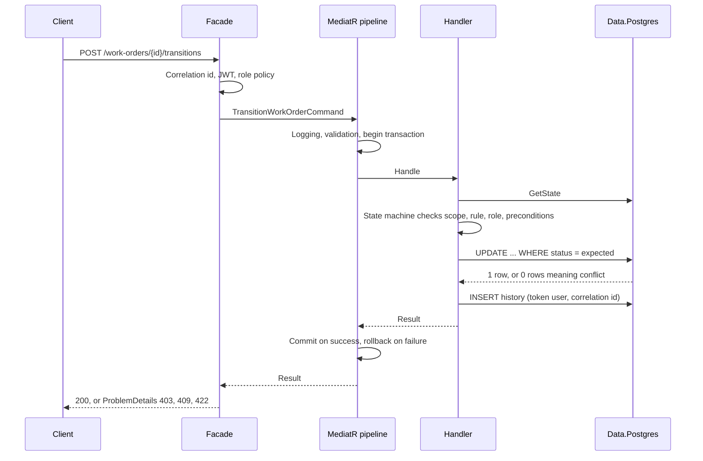
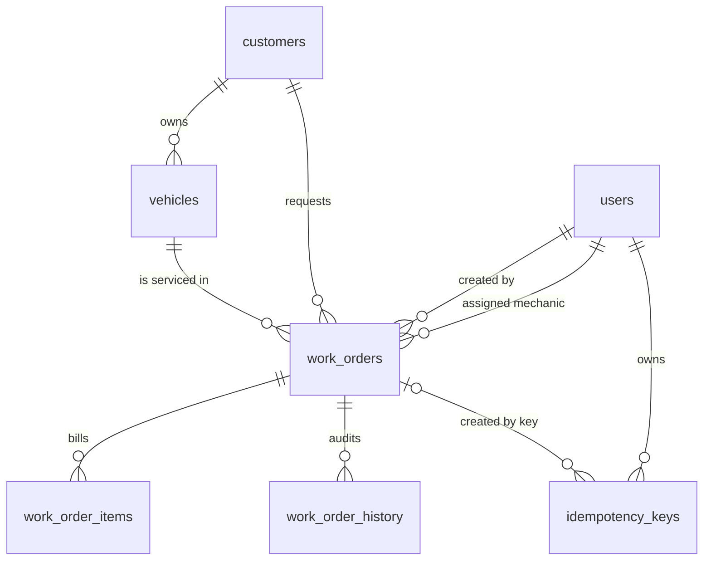

# Architecture notes

WorkshopManager is a standalone API with a single-page client. This page explains how the code is organised and why. The README has the quick start.

## Projects and dependencies

| Project | Responsibility | May reference |
|---|---|---|
| `Domain` | Models, enums, `Result` and `Error`, state machine, pricing, repository and service interfaces | Nothing but the base class library |
| `Service` | One folder per use case with `Command` or `Query`, `Handler` and `Validator`; behaviors for logging, validation and transactions | `Domain` |
| `Data.Postgres` | Dapper repositories, `PostgresSession` (Unit of Work), connection retry, health probe | `Domain` |
| `Util` | `AddInfraestructura` composition root, Serilog, OpenTelemetry, JWT and password hashing, health checks | `Service`, `Data.Postgres`, `Domain` |
| `Facade` | Host, endpoints, Request and Response contracts, JWT bearer setup, policies, middleware, OpenAPI | `Util`, `Service`, `Domain` |

`Service` and `Data.Postgres` never reference each other: handlers talk to repositories through interfaces that live in `Domain`. `tests/ArchitectureTests` fails the build when any of these rules is broken.

## Request lifecycle

## Data model

Every table has `COMMENT ON` descriptions in `sql/01-schema.sql`. `work_orders.status` and `work_order_items.item_type` are guarded by check constraints, and `work_orders.order_number` comes from a sequence and is shown as `WO-nnnn`.

## Transition rules

| From | To | Roles | Preconditions |
|---|---|---|---|
| Received | Diagnosed | Mechanic (assigned), Admin | Mechanic assigned |
| Diagnosed | Approved | Advisor, Admin | At least one line item |
| Approved | InProgress | Mechanic (assigned), Admin | Mechanic assigned |
| InProgress | Completed | Mechanic (assigned), Admin | Mechanic assigned |
| Completed | Delivered | Advisor, Admin | None |
| Received, Diagnosed, Approved | Cancelled | Advisor, Admin | None |

The check order is deliberate: scope first (a mechanic that does not own the order gets 403 whatever they ask for), then whether the transition exists (422), then the role (403), then the preconditions (422). The conditional `UPDATE` is the final arbiter and produces 409.

## Error mapping

| Situation | HTTP status |
|---|---|
| Invalid input, malformed request | 400 |
| Missing or invalid token, bad credentials | 401 |
| Role not allowed, order not assigned to the mechanic | 403 |
| Unknown customer, vehicle or order | 404 |
| Duplicate email or plate, stale status, lost race | 409 |
| Invalid transition, business rule, key reused with another payload | 422 |
| Too many login attempts | 429 |
| Anything unexpected | 500 with a generic message |

## Observability

- Logs are JSON (Serilog compact format) and always include `correlation_id`; `trace_id` is added whenever an activity is active.
- OpenTelemetry instruments ASP.NET Core, outgoing HTTP and Npgsql. Setting `OTEL_EXPORTER_OTLP_ENDPOINT` exports traces and metrics through OTLP, for example to Grafana Alloy.
- `/health/live` never touches a dependency. `/health/ready` opens a database connection, so Kubernetes stops sending traffic when PostgreSQL is unreachable without restarting the pod.

## Security notes

- Passwords use PBKDF2-SHA256 with 310,000 iterations and a random salt per user, compared in constant time.
- The login endpoint is rate limited per client IP. Behind a reverse proxy the real address comes from `X-Forwarded-For`; in a public deployment restrict the trusted proxies in `Program.cs`.
- CORS is only enabled when `Cors__AllowedOrigins` is set, and never together with credentials.
- Secrets come from environment variables. `.env` is ignored by git and `.env.example` holds placeholders only.
- Containers run as a non-root user and the nginx image is the unprivileged variant.
